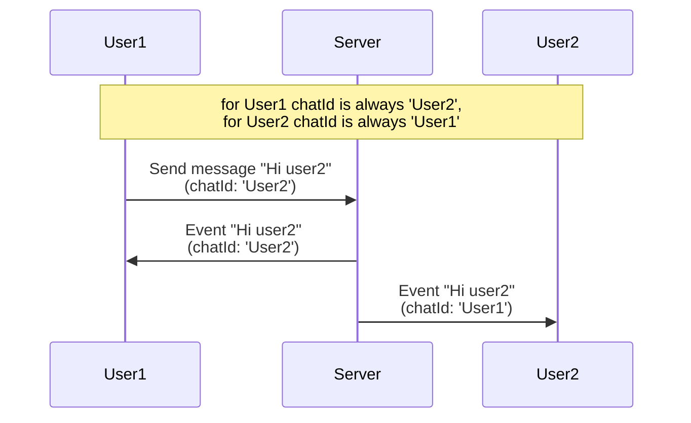

## Dialogs visual schema

```mermaid
sequenceDiagram
    participant User1
    participant Server
    participant User2

    Note over User1, User2: for User1 chatId is always 'User2',<br/> for User2 chatId is always 'User1'

    User1->>Server: Send message "Hi user2"<br/>(chatId: 'User2')
    Server->>User1: Event "Hi user2"<br/>(chatId: 'User2')
    Server->>User2: Event "Hi user2"<br/>(chatId: 'User1')
```
