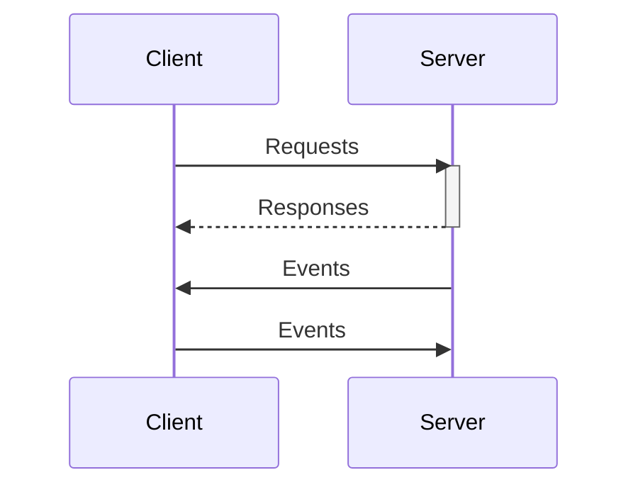

# WebSocket overview

This document provides an overview of the WebSocket protocol, which is used for messaging

## Message types

### 1. Client Request

Clients send requests to perform actions like sending, editing, or deleting messages. Each request includes a timestamp and a unique identifier for tracking and synchronization.

| Field       | Type                                                              | Example                                         |
| ----------- | ----------------------------------------------------------------- | ----------------------------------------------- |
| type        | const                                                             | "request"                                       |
| timestamp   | number                                                            | 1700000000000                                   |
| id          | string                                                            | "req001"                                        |
| payloadType | "new", “edit”, “delete”, ... see [requests](./client-requests.md) |
| payload     | any                                                               | `{"chatId":"User2","message":"Hi from User1!"}` |

### 2. Server Response

The server sends an response message in response to client requests,confirming that the requested action has been processed.

| Field     | Type   | Example           |
| --------- | ------ | ----------------- |
| type      | const  | "response"        |
| timestamp | number | 1700000000000     |
| id        | string | "req001"          |
| payload   | any    | `{"messageId":5}` |

### 3. Server Event

Server events are notifications or updates that are pushed to other clients involved in the chat, such as new messages or changes to
existing ones.

| Field     | Type               | Example |
| --------- | ------------------ | ------- |
| type      | const              | "event" |
| timestamp | number             |         |
| id        | string             |         |
| eventType | Event              |         |
| payload   | ServerEventPayload |         |
