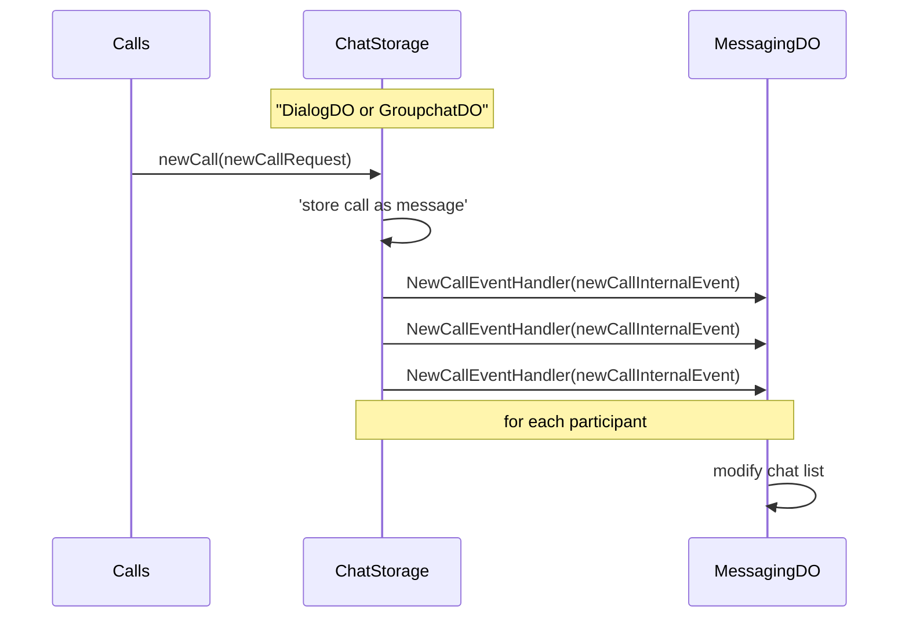

# calls note

1. **Big-Calls** sends a `newCall(newCallRequest)` to **ChatStorage**.
2. **ChatStorage** stores the call as a message.
3. **ChatStorage** sends `NewCallEventHandler(newCallInternalEvent)` to **MessagingDO**.
4. **ChatStorage** repeats sending `NewCallEventHandler(newCallInternalEvent)` to **MessagingDO** for each participant.
5. **MessagingDO** modifies the chat list accordingly.