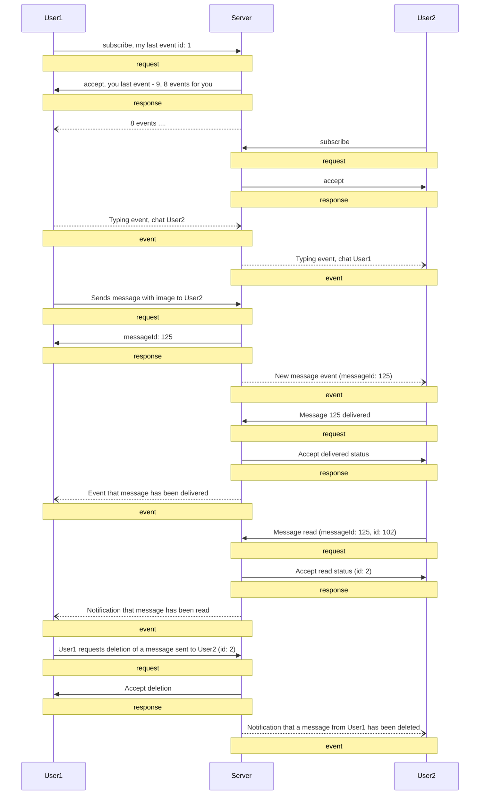

# Examples

## Example: full cycle of message

[jsons](examples.md)



User1 to server: subscribe

```json
{
  "type": "request",
  "id": "0",
  "timestamp": 1700500000,
  "payloadType": "subscribe",
  "payload": {
    "lastEventId": 1
  }
}

```

Server to User1: 🫡

```json
{
  "type": "response",
  "timestamp": 1700700000,
  "id": "0",
  "payload": { 
    "lastEventId": 9 
  }
}
```

User2 to server: subscribe

```json
{
  "type": "request",
  "id": "0",
  "timestamp": 1700800000,
  "payloadType": "subscribe",
  "payload": {
    "lastEventId": 0
  }
}

```

Server to User2: 🫡

```json
{
  "type": "response",
  "timestamp": 1700900000,
  "id": "0",
  "payload": { 
    "lastEventId": 0 
  }
}
```

User1 to server: user1 is typing a message to user2

```json
{
  "type": "request",
  "timestamp": 1700500000,
  "payloadType": "typing",
  "payload": {
    "chatId": "User2"
  }
}

```

Server to User2: typing event notification

```json
{
  "type": "event",
  "timestamp": 1700500000,
  "eventType": "typing",
  "payload": {
    "chatId": "User1"
  }
}

```

User1 to server: user1 sends a message with an image to user2

```json
{
  "type": "request",
  "timestamp": 1700300000,
  "id": "1",
  "payloadType": "new",
  "payload": {
    "chatId": "User2",
    "message": "Check out this photo!",
    "attachments": [
      {
        "type": "image",
        "id": "img123",
        "filename": "photo.jpg",
        "url": "<http://example.com/photo.jpg>",
        "payload": {
          "mimetype": "image/jpeg",
          "width": 1024,
          "height": 768,
          "size": 204800
        }
      }
    ]
  }
}

```

Server to User1: 🫡

```json
{
  "type": "response",
  "timestamp": 1700200000,
  "id": "1",
  "payload": { "messageId": 125 }
}
```

Server to User2: New Message Event with Image

```json
{
  "type": "event",
  "timestamp": 1700300000,
  "id": 1,
  "eventType": "new",
  "payload": {
    "chatId": "User1",
    "userId": "User1",
    "messageId": 125,
    "message": "Check out this photo!",
    "attachments": [
      {
        "type": "image",
        "id": "img123",
        "filename": "photo.jpg",
        "url": "<http://example.com/photo.jpg>",
        "payload": {
          "mimetype": "image/jpeg",
          "width": 1024,
          "height": 768,
          "size": 204800
        }
      }
    ]
  }
}

```

User2 to server: message delivered

```json
{
  "type": "request",
  "timestamp": 1700200000,
  "id": "101",
  "payloadType": "dlvrd",
  "payload": {
    "chatId": "User1",
    "messageId": 125
  }
}
```

Server to User2: 🫡

```json
{
  "type": "response",
  "timestamp": 1700200000,
  "id": "101"
}
```

Server to user1: notification that message from user2 has been delivered

```json
{
  "type": "event",
  "timestamp": 1700200000,
  "id": 10,
  "eventType": "dlvrd",
  "payload": {
    "chatId": "User1",
    "messageId": 125
  }
}
```

User2 to server: message read

```json
{
  "type": "request",
  "timestamp": 1700200000,
  "id": "102",
  "payloadType": "read",
  "payload": {
    "chatId": "User1",
    "messageId": 125
  }
}
```

Server to User2: response 🫡

```json
{
  "type": "response",
  "timestamp": 1700200002,
  "id": "102",
  "payloadType": "read",
  "payload": {
    "chatId": "User1",
    "messageId": 125
  }
}
```

Server to User1: notification that message from user2 has been read

```json
{
  "type": "event",
  "timestamp": 1700200000,
  "id": 11,
  "eventType": "read",
  "payload": {
    "chatId": "User2",
    "messageId": 125
  }
}
```

User1 to server: user1 requests deletion of a message sent to user2

```json
{
  "type": "request",
  "timestamp": 1700400000,
  "id": "2",
  "payloadType": "delete",
  "payload": {
    "chatId": "User2",
    "messageId": 125
  }
}
```

Server to User1: response 🫡

```json
{
  "type": "response",
  "timestamp": 1700400002,
  "id": "2"
}
```

Server to user2: notification that a message from user1 has been deleted

```json
{
  "type": "event",
  "timestamp": 1700500000,
  "id": 2,
  "eventType": "delete",
  "payload": {
    "chatId": "User1",
    "messageId": 125
  }
}
```

## Example: user status notifications

### Online notification

Server to User2: User1 Comes Online (without id)

```json
{
  "type": "event",
  "timestamp": 1700400000,
  "eventType": "online",
  "payload": {
    "userId": "User1"
  }
}

```

### Offline notification

User1 to server: User1 Comes Offline

```json
{
  "type": "event",
  "timestamp": 1700400000,
  "eventType": "offline"
}

```

Server to User2: User1 Goes Offline

```json
{
  "type": "event",
  "timestamp": 1700400000,
  "eventType": "offline",
  "payload": {
    "userId": "User1"
  }
}

```
