# Examples

## Example: full cycle of message

[jsons](examples.md)

```mermaid
sequenceDiagram
    participant User1
    participant Server
    participant User2

    

        
    Note over User1,User2: "typing"
    User1->>Server: client event 'typing', chatId User2
    activate Server
    
    Server->>User2: server event 'typing', chatId User1
    deactivate Server

    Note over User1,User2: message sending
    User1->>Server: Sends message to User2
    activate Server
    Note over User1,Server: request 'new'
    Server->>User1: messageId: 125
    Note over  Server,User1: response to 'new' request
    Server->>User2: server event 'new' (messageId: 125)
    User2--)Server: Ack for 'new' event
    deactivate Server
    Note over User1,User2: "delivering"
    
    User2->>Server: Message 125 delivered
    activate Server
    Note over  User2,Server: request 'dlvrd'
    Server->>User2: 🫡
    Note over  Server,User2: response to 'dlvrd'
    Server->>User1: Event that message has been delivered
    Note over  Server,User1: server event 'dlvrd'
    User1->>Server: Ack for dlvrd event
    
    
    User2->>Server: Message read (messageId: 125)
    Note over User2,Server: request 'read'
    Server->>User2: 🫡
    Note over  Server,User2: response
    
    Server--)User1: Notification that message has been read
    Note over  Server,User1: server event 'read'
    User1->>Server: Ack for read event
    
        
    User1->>Server: User1 requests deletion of a message sent to User2 (id: 2)
    Note over User1,Server: request
    
    Server->>User1: Accept deletion
    Note over Server,User1: response
    Server--)User2: Notification that a message from User1 has been deleted
    Note over  Server,User2: event
    User2->>Server: Ack for message deleted event
    
    
```



User1 to server: User1 is typing a message to User2

```json
{
  "type": "event",
  "timestamp": 1700500000000,
  "payloadType": "typing",
  "payload": {
    "chatId": "User2"
  }
}

```

Server to User2: typing event notification

```json
{
  "type": "event",
  "timestamp": 1700500000000,
  "eventType": "typing",
  "payload": {
    "chatId": "User1"
  }
}

```

User1 to server: User1 sends a message with an image to User2

```json
{
  "type": "request",
  "timestamp": 1700300000000,
  "id": "1",
  "payloadType": "new",
  "payload": {
    "chatId": "User2",
    "clientMessageId": "9CD99794-6D8E-4E82-9C97-D474831A43E3",
    "message": "Check out this photo!",
    "attachments": [
      {
        "type": "image",
        "id": "img123",
        "filename": "photo.jpg",
        "url": "<http://example.com/photo.jpg>",
        "meta": {
          "mimetype": "image/jpeg",
          "width": 1024,
          "height": 768,
          "size": 204800
        }
      }
    ]
  }
}

```

Server to User1: 🫡

```json
{
  "type": "response",
  "timestamp": 1700200000000,
  "id": "1",
  "payload": { "messageId": 125, "clientMessageId": "9CD99794-6D8E-4E82-9C97-D474831A43E3" }
}
```

Server to User2: New Message Event with Image

```json
{
  "type": "event",
  "timestamp": 1700300000000,
  "id": 1,
  "eventType": "new",
  "payload": {
    "chatId": "User1",
    "messageId": 125,
    "clientMessageId": "9CD99794-6D8E-4E82-9C97-D474831A43E3",
    "message": "Check out this photo!",
    "attachments": [
      {
        "type": "image",
        "id": "img123",
        "filename": "photo.jpg",
        "url": "<http://example.com/photo.jpg>",
        "meta": {
          "mimetype": "image/jpeg",
          "width": 1024,
          "height": 768,
          "size": 204800
        }
      }
    ],
    "missed": 1
  }
}

```

User2 to server: ack

```json
{
  "type": "ack",
  "id": 1  
}
```

User2 to server: message delivered

```json
{
  "type": "request",
  "timestamp": 1700200000000,
  "id": "101",
  "payloadType": "dlvrd",
  "payload": {
    "chatId": "User1",
    "messageId": 125
  }
}
```

Server to User2: 🫡

```json
{
  "type": "response",
  "timestamp": 1700200000000,
  "id": "101"
}
```

Server to User1: notification that message from User2 has been delivered

```json
{
  "type": "event",
  "timestamp": 1700200000000,
  "id": 1,
  "eventType": "dlvrd",
  "payload": {
    "chatId": "User1",
    "messageId": 125,
    "clientMessageId": "9CD99794-6D8E-4E82-9C97-D474831A43E3"
  }
}
```

User1 to server: ack

```json
{
  "type": "ack",
  "id": 1  
}
```

User2 to server: message read

```json
{
  "type": "request",
  "timestamp": 1700200000000,
  "id": "102",
  "payloadType": "read",
  "payload": {
    "chatId": "User1",
    "messageId": 125
  }
}
```

Server to User2: response 🫡

```json
{
  "type": "response",
  "timestamp": 1700200002000,
  "id": "102",
  "payloadType": "read",
  "payload": {
    "chatId": "User1",
    "messageId": 125,
    "clientMessageId": "9CD99794-6D8E-4E82-9C97-D474831A43E3",
    "missed": 0
  }
}
```

Server to User1: notification that message from User2 has been read

```json
{
  "type": "event",
  "timestamp": 1700200000000,
  "id": 2,
  "eventType": "read",
  "payload": {
    "chatId": "User2",
    "messageId": 125,
    "clientMessageId": "9CD99794-6D8E-4E82-9C97-D474831A43E3"
  }
}
```

User1 to server: ack

```json
{
  "type": "ack",
  "id": 2 
}
```

User1 to server: User1 requests deletion of a message sent to User2

```json
{
  "type": "request",
  "timestamp": 1700400000000,
  "id": "2",
  "payloadType": "delete",
  "payload": {
    "chatId": "User2",
    "messageId": 125,
    "clientMessageId": "9CD99794-6D8E-4E82-9C97-D474831A43E3"
  }
}
```

Server to User1: response 🫡

```json
{
  "type": "response",
  "timestamp": 1700400002000,
  "id": "2"
}
```

Server to User2: notification that a message from User1 has been deleted

```json
{
  "type": "event",
  "timestamp": 1700500000000,
  "id": 2,
  "eventType": "delete",
  "payload": {
    "chatId": "User1",
    "messageId": 125,
    "clientMessageId": "9CD99794-6D8E-4E82-9C97-D474831A43E3"
  }
}
```

User2 to server: ack

```json
{
  "type": "ack",
  "id": 2 
}
```


## Example: user status notifications

### Online notification

Server to User2: User1 Comes Online (without id)

```json
{
  "type": "event",
  "timestamp": 1700400000000,
  "eventType": "online",
  "payload": {
    "userId": "User1"
  }
}

```

### Offline notification

User1 to server: User1 Comes Offline

```json
{
  "type": "event",
  "timestamp": 1700400000000,
  "eventType": "offline"
}

```

Server to User2: User1 Goes Offline

```json
{
  "type": "event",
  "timestamp": 1700400000000,
  "eventType": "offline",
  "payload": {
    "userId": "User1"
  }
}

```

## ack

Client to server: Acknowledgment of an event

```json
{
  "type": "ack",
  "id": 23
}
```

Server to client: Acknowledgment received

```json
{
  "type": "response",
  "timestamp": 1700200000000,
  "id": "23"
}
```

## dlvrd

User1 to server

```json
{
    "type": "request",
    "timestamp": 1700300000000,
    "id": "14",
    "payloadType": "dlvrd",
    "payload": {
        "chatId": "User2"
    }
}
```

Server to User1

```json

{"type":"response","id":"14","timestamp":1714343766000,"payload":{}}
```

Server to User2

```json
{
    "eventType": "dlvrd",
    "id": 6,
    "payload": {
        "chatId": "User1",
        "messageId": 15,
        "timestamp": 1714343766000
    },
    "timestamp": 1714343766000,
    "type": "event"
}
```
