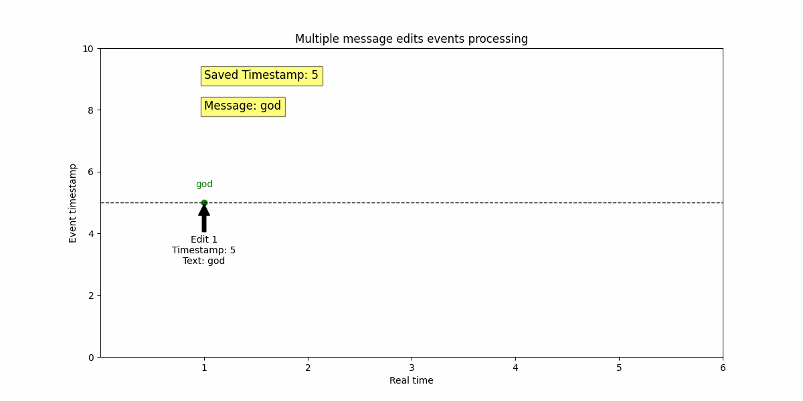

# Handling Out-of-Order Events

Events can arrive in any order. For example, a user may go offline and then come back online. If this is not taken into account, the following issues may arise:

## Problems Without Proper Event Handling

1. **Online/Offline:**
Events can arrive in any order. For example, a user might go offline first and then come back online. If the system does not account for timestamps, the user's status may remain "offline" even though they are actually online. This leads to incorrect status display.

2. **Last Messages for Chat List:**
New message events can also arrive in any order. For example, a chat message might arrive later than it was sent. If timestamps are not considered and events are not grouped by `chatId`, outdated messages might be displayed in the chat list, showing users incorrect message order.

3. **Editing:**
Edit events can arrive in any order. For example, the first edit event of message might arrive later than the second edit event. If the combination of `chatId` and `messageId` is not considered, the system might process the second edit first and then the first edit, leading to loss of edit data and incorrect information display.

## Solution: Defining Keys for Events

1. **Online/Offline:**
Use `userId` as the key. Example: `online-status:bS8JHietAb5O4l7KvGIwf`.
   
2. **Last Messages for Chat List:**
Use `chatId` as the key. Example: `chat:superId`.
   
3. **Editing:**
Use a combination of `chatId` and `messageId` as the key. Example: `edit:chat123:1002`.

## Event Processing Rules

1. **Store the last timestamp for each key:**
Keep track of the last timestamp for each key.

2. **Compare the new event's timestamp with the stored one:**
When a new event arrives, determine its key and compare its timestamp with the stored one.

3. **Discard outdated events:**
If the new timestamp is less than the stored timestamp, discard the event. (Note: if it is a new message event for the chat list, it will not be applied to the chat list, but the message itself will be loaded).

4. **Accept and update the timestamp:**
If the new timestamp is greater, update the stored timestamp for the key and accept the event.

