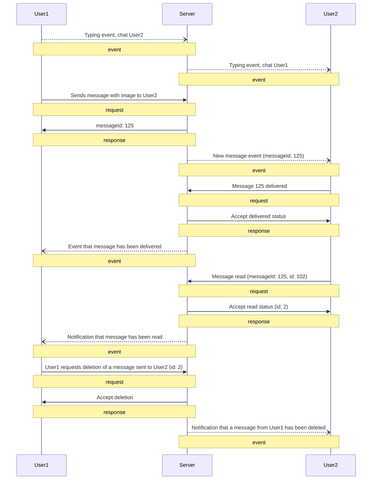

# WebSocket protocol

This document provides an overview of the WebSocket protocol, which is used for messaging

## Message types


### 1. Client Request

Clients send requests to perform actions like sending, editing, or deleting messages. Each request includes a timestamp and a unique identifier for tracking and synchronization.

| Field       | Type                                                              | Example                                             |
| ----------- | ----------------------------------------------------------------- | --------------------------------------------------- |
| type        | const                                                             | "request"                                           |
| timestamp   | number                                                            | 1700000000000                                       |
| id          | string                                                            | "req001"                                            |
| payloadType | "new", “edit”, “delete”, ... see [requests](./client-requests.md) | "new"                                               |
| payload     | [requests](./client-requests.md)                                  | ****`{"chatId":"User2","message":"Hi from User1!"}` |

### 2. Server Response

The server sends an response message in response to client requests,confirming that the requested action has been processed.

| Field     | Type   | Example           |
| --------- | ------ | ----------------- |
| type      | const  | "response"        |
| timestamp | number | 1700000000000     |
| id        | string | "req001"          |
| payload?  | any    | `{"messageId":5}` |

### 3. Server Event and Acknowledgment

Server events are notifications or updates that are pushed to other clients involved in the chat, such as new messages or changes to
existing ones. Clients must acknowledge receipt of these events by sending an acknowledgment message back to the server.

| Field     | Type                              | Example               |
| --------- | --------------------------------- | --------------------- |
| type      | const                             | "event"               |
| timestamp | number                            | 1700000000000         |
| id        | number                            | 23                    |
| eventType | [ServerEvent](./server-events.md) | "online"              |
| payload?  | [ServerEvent](./server-events.md) | `{"userId": "User2"}` |

### 4. Acknowledgment

Clients must send an acknowledgment message back to the server for each event received.

| Field | Type   | Example |
| ----- | ------ | ------- |
| type  | const  | "ack"   |
| id    | number | 23      |

Example acknowledgment message:

```json
{
  "type": "ack",
  "id": 23
}
```

!!! info "WebSocket Connection Timeout"
    If there is no ping from the client for 20 seconds, the WebSocket connection will be closed, and an "offline" event will be sent to all participants.

!!! info "Sequence of events by ID"
    id - increasing int

### Example

[jsons](examples.md)


